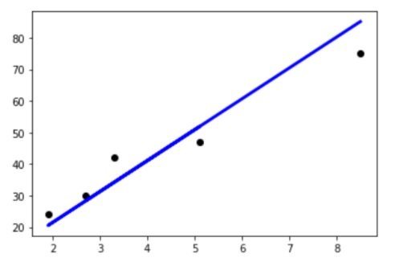

# Student Exam Evaluation

Developed a Machine Learning model using Linear Regression supervised learning technique.
Based on the student dataset containing hours and marks obtained by the particular student, it will predict the average marks on any test data based on the hours of study.
(The raw data were collected from online sources.)

### Output :

